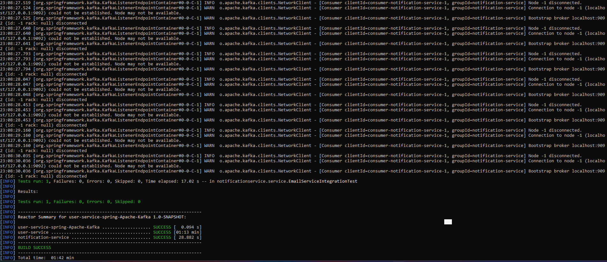

[](https://qlty.sh/gh/irinakomarchenko/projects/user-service-spring-Apache-Kafka)

# User Service & Notification Service

**User Service** — микросервис на Spring Boot для управления пользователями (CRUD) и публикации событий о создании/удалении пользователей в Kafka.
**Notification-service** —  микросервис, который слушает события из Kafka и отправляет email-уведомления пользователям. Также предоставляет API для отправки email.


---

## Технологии

- Java 22
- Spring Boot
- Spring Web (REST API)
- Spring Data JPA (встроенный Hibernate)
- Spring Kafka (Kafka Producer)
- PostgreSQL (через Docker Compose)
- Apache Kafka (интеграция через Spring Kafka)
- SLF4J + Logback (логирование)
- JUnit 5 + MockMvc (тестирование контроллеров и API)
- Maven (сборка и зависимости)
- Checkstyle (проверка стиля кода)
- Lombok — (автогенерации геттеров/сеттеров)
---

## Запуск проекта

### 1. Клонировать репозиторий

```sh
git clone https://github.com/ТВОЙ_ЛОГИН/user-service-spring-Apache-Kafka.git
cd user-service-spring-Apache Kafka
```
###  Запустить PostgreSQL и Kafka (Docker Compose)
```sh
docker compose up -d
```
### 3. Собрать проект и проверить стиль кода

```sh
mvn clean install
mvn checkstyle:check
```
### 4. Запустить тесты

```sh
mvn test
```
### 5. Формирование отчета о тестах

```sh
mvn verify
```

### 6. Запустить приложение


```sh
mvn clean package
java -jar target/user-service-spring.jar
```

### 7. Пример работы приложения



[](https://asciinema.org/a/724582)

