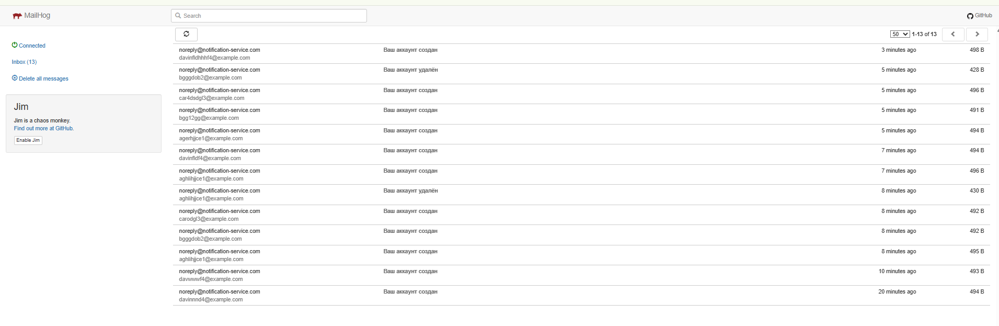

[](https://qlty.sh/gh/irinakomarchenko/projects/user-service-spring-Apache-Kafka)

# user-service-cloud-architecture

### Микросервисная система управления пользователями и уведомлениями на Spring Boot, Kafka, Eureka, Docker и PostgreSQL.

**User Service** — микросервис на Spring Boot для управления пользователями (CRUD) и публикации событий о создании/удалении пользователей в Kafka.

**Notification-service** — микросервис, который слушает события из Kafka и отправляет email-уведомления пользователям. Также предоставляет API для отправки email.

**Gateway API** — микросервис, реализующий единый точку входа в систему (API Gateway на Spring Cloud Gateway). Маршрутизирует HTTP-запросы к нужным микросервисам.

**Discovery Server** — сервис регистрации и обнаружения (на базе Spring Cloud Eureka). Хранит реестр всех активных сервисов в системе, обеспечивает автоматическую маршрутизацию и отказоустойчивость.

**Config Server** — централизованный сервер конфигурации (Spring Cloud Config). Управляет конфигурационными файлами для всех микросервисов из единого репозитория.

**Kafka** — брокер сообщений (Apache Kafka), обеспечивает надёжную асинхронную передачу событий между сервисами.

**Mailhog** — сервис для перехвата и просмотра тестовых email-сообщений через web-интерфейс. Используется для локальной отладки отправки писем.

**PostgreSQL** — реляционная база данных для хранения информации о пользователях и событиях (используется user-service).

---

## Технологии

- Java 22
- Spring Boot  (Spring Web, Spring Data JPA, Spring Kafka)
- PostgreSQL (через Docker)
- Apache Kafka (через Docker)
- Spring Cloud (Gateway, Eureka Discovery, Config Server)
- PostgreSQL (через Docker Compose)
- JUnit 5, MockMvc (тестирование)
- JLombok, SLF4J, Logback, Checkstyle
- Docker (для контейнеризации сервисов)
---

## Запуск проекта

### 1. Клонировать репозиторий

```sh
git clone https://github.com/ТВОЙ_ЛОГИН/user-service-spring-Apache-Kafka.git
cd user-service-spring-Apache Kafka
```
###  Запустить PostgreSQL и Kafka (Docker Compose)
```sh
docker compose up -d
```
### 3. Собрать проект и проверить стиль кода

```sh
mvn clean install
mvn checkstyle:check
```
### 4. Запустить тесты

```sh
mvn test
```
### 5. Формирование отчета о тестах

```sh
mvn verify
```

### 6. Запустить приложение

#### Собрать артефакты (JAR-файлы) для каждого микросервиса:

```sh
mvn clean package
```
#### Запустить все сервисы и инфраструктуру с помощью Docker Compose:
```sh
docker compose up -d
```
Все сервисы (user-service, notification-service, gateway, discovery-server, config-server, kafka, postgres, mailhog) будут подняты как отдельные контейнеры.

#### Проверить статус контейнеров:
```sh
docker compose ps
```

#### Остановить все сервисы:
```sh
docker compose down
```

#### Для обновления jar-файлов после изменения кода пересоберите сервисы и перезапустите соответствующие контейнеры:
```sh
mvn clean package -DskipTests
docker compose up --build -d
```


### 7. Пример работы приложения

#### PostgreSQL Demo

#### Eureka Demo

#### Mailhog Demo


#### Kafka, Mailhog Demo
[](https://asciinema.org/a/724889)
#### Spring Cloud Microservices Demo
[](https://asciinema.org/a/726961)

